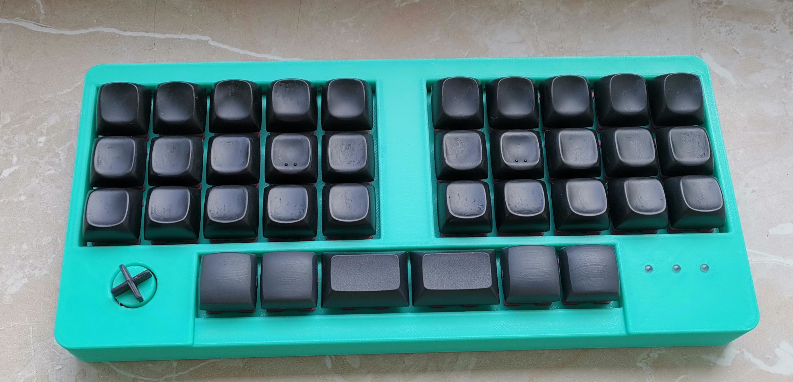

# Klackerkasten

Note: If you are not hand solerding the components then triple check the component orientation. I went
the PCBA route with JLC and there were two rotated components.

# Acknowledgments

- Weteor for his amazing BrkOut which was a big inspiration.
- NcKiser for the STM32F072\_template which helped me a lot for this project.
- The mad crowd of the Clack Tales discord server. Thanks for answering all my endless questions!
